# metrics-collection-monitoring-system
Create a metrics collection and monitoring system in python that captures system metrics, stores them, and provides a way to query and visualize the metrics

## Features

- Metrics Collection
- Data Storage
- API Endpoint
- Alerting Mechanism
- Visualization

## Metrics Collection:

- **CPU Usage**: The system's CPU usage is monitored and collected using `psutil`.
- **Memory Usage**: The system's memory usage is tracked and collected using `psutil`.
- **Disk Usage**: The system's disk usage is observed and collected using `psutil`.
- **Prometheus Metrics**: The metrics are exposed to Prometheus using the `prometheus_client` library on the `/metrics` endpoint.

## Data Storage:

- **Prometheus**: The collected metrics are stored in Prometheus, a time-series database that allows for efficient querying and alerting based on the metrics data.

## API Endpoint:

- **Flask Application**: A Flask web application provides API endpoints for interacting with the collected metrics.
  - **Average Usage Endpoint**: `/avg_usage` - Provides the **average** usage of CPU, memory, or disk over a specified time range.
  - **Metrics Usage Endpoint**: `/metrics_usage` - Returns the **metrics** data points for CPU, memory, or disk over a specified time range.
  - **Alert Endpoint**: `/alert` - Receives alerts from Prometheus Alertmanager via HTTP POST.

## Alerting Mechanism:

- **Prometheus Alertmanager**: Configured to send alerts based on predefined rules when certain thresholds are met.
- **Custom Alerts**: Alerts for high CPU, memory, or disk usage are configured with specific thresholds and sent to Alertmanager.
- **HTTP POST Receiver**: Alerts are received by the Flask application via the `/alert` endpoint.

## Visualization:

- **Grafana**: A visualization tool that can be used to create dashboards for monitoring the collected metrics in real-time.
- **Prometheus Web UI**: Provides a basic visualization and querying interface for the collected metrics.
- **Custom Dashboards**: Dashboards can be created in Grafana to visualize CPU, memory, and disk usage trends over time.

# Setup Guide

## Prerequisites

- Docker installed on your machine.
- GNU `make` installed.

## Step 1: Clone the Repository

First, clone the repository to your local machine:

```
git clone https://github.com/shaheen0b111/metrics-collection-monitoring-system.git
cd metrics-collection-monitoring-system
```

## Step 2: Build and Start the Stack

Use the `Makefile` to set up and start the monitoring stack.

### Start All Services

This command will start the Metrics Collector, Prometheus, Grafana, and Alertmanager containers:

```
sudo make all
```

- **Metrics Collector**: Available at [http://localhost:8080/metrics](http://localhost:8080/metrics)
- **Web UI/ API endpoints**: Available at [http://localhost:5000/](http://localhost:5000/)
- **Prometheus**: Available at [http://localhost:9090/](http://localhost:9090/)
- **Grafana**: Available at [http://localhost:3000/](http://localhost:3000/) (Default login: `admin/admin`)
- **Alertmanager**: Available at [http://localhost:9093/](http://localhost:9093/)

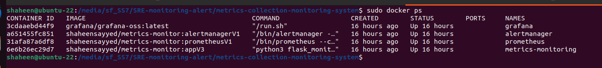

## Step 3: Run Unit Tests
To run the unit tests for the Python application, use the following command:
```
sudo make test
```

#### unit test execution output
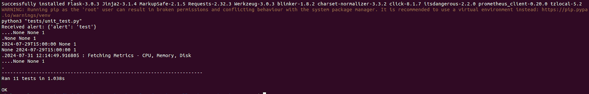

This will execute the unit tests located in the `unit_test.py` file.

## Step 4: Clean Up
If you want to stop and remove all the containers, you can use the clean_all target:
```
sudo make clean_all
```

This will remove all the containers for Metrics Collector, Prometheus, Grafana, and Alertmanager.

Alternatively, you can remove specific containers using the respective clean targets:

- Metrics Collector: `sudo make clean_metrics_monitoring`
- Prometheus: `sudo make clean_prometheus`
- Grafana: `sudo make clean_grafana`
- Alertmanager: `sudo make clean_alertmanager`

## Additional Makefile Targets
### Create Volumes
Persistent volumes for Prometheus and Grafana are created during the setup:
- Prometheus Volume: `sudo make create-prometheus-volume`
- Grafana Volume: `sudo make create-grafana-volume`

### Start Individual Services
If you want to start specific services individually, use the following commands:

- Metrics Collector: `sudo make start-metrics-monitoring`
- Prometheus: `sudo make start-prometheus`
- Grafana: `sudo make start-grafana`
- Alertmanager: `sudo make start-alertmanager`

## Troubleshooting
- Ensure Docker is running and that you have the necessary permissions to run Docker commands.
- If ports are already in use, either stop the running services or change the ports in the Makefile and the respective configurations.

## Workflow
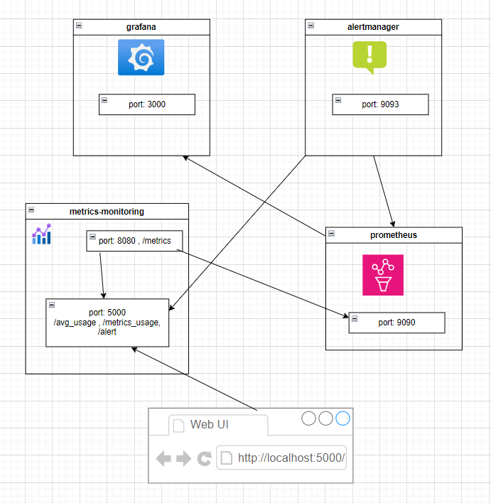

### 1. Metrics Collection by Prometheus Client
- The system metrics such as CPU, Memory, and Disk usage in percentage are collected by a Prometheus client running in the `metrics-monitoring` container.
- The Prometheus client exposes these metrics on port `8080` at the `/metrics` endpoint of the `metrics-monitoring` container.

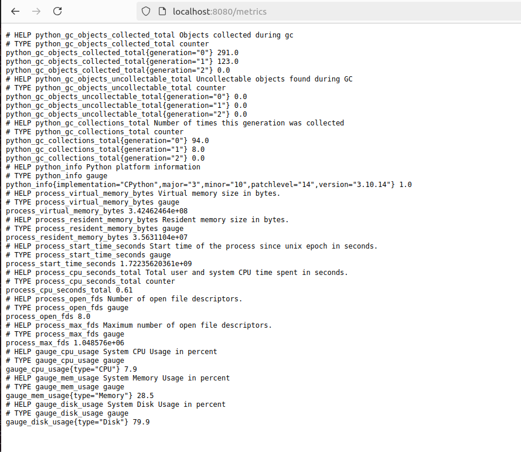

### 2. Web Application Endpoint
- The `metrics-monitoring` container also runs a web application that is exposed on port `5000`.
- App is logging in file `server.log`
- This web application serves several endpoints:
  - `/metrics_usage`: Provides detailed metrics usage.
  - `/avg_usage`: Provides average usage metrics.
  - `/alert`: Logs alerts triggered by Alertmanager.

#### Metrics app dashboard
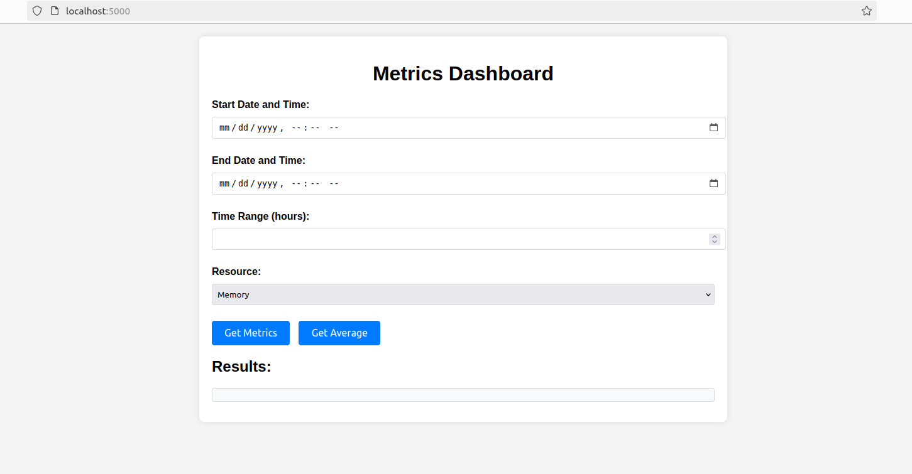

### server.log
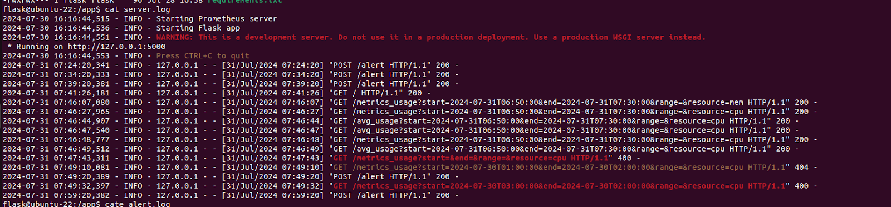

### 3. Prometheus Server Configuration
- The Prometheus server runs on port `9090`.
- It is configured to scrape metrics from the `metrics-monitoring` container by accessing the `/metrics` endpoint on port `8080`.
- The Prometheus configuration file includes the `metrics-monitoring` scrape [configuration](https://github.com/shaheen0b111/metrics-collection-monitoring-system/config/prometheus/prometheus.yml) to ensure regular data collection.
- The Alert [rules](https://github.com/shaheen0b111/metrics-collection-monitoring-system/config/prometheus/alert-rules.yml) configuration file is also configured on prometheus which is evaluated on regularly basis and accordingly details are sent to alertmanager configured in [prometheus.yml](https://github.com/shaheen0b111/metrics-collection-monitoring-system/config/prometheus/prometheus.yml)

#### prometheus alert page
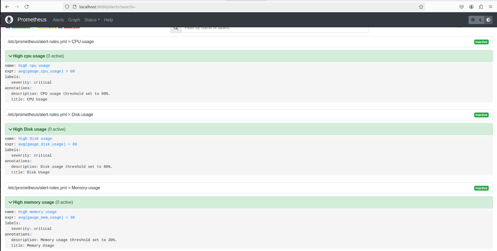

#### prometheus graph page
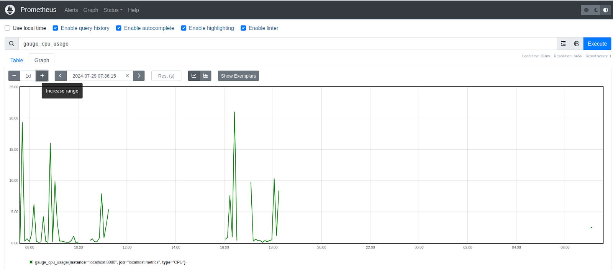

### 4. Alertmanager Configuration
- Alertmanager runs in a separate container on port `9093`.
- Alertmanager is set up where the [alert](https://github.com/shaheen0b111/metrics-collection-monitoring-system/config/alertmanager/alertmanager.yml) should be notified. Here it is configured as Webhook Post request
- When the usage exceeds predefined threshold values, an alert is triggered.

### 5. Alert Handling and Logging
- The alert triggered by Alertmanager is sent to the `/alert` endpoint of the `metrics-monitoring` container.
- The web application in `metrics-monitoring` logs the alert details into an `alert.log` file for monitoring and record-keeping.

#### alert.log
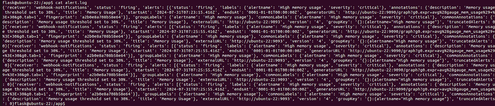

### 6. Grafana for Visualization
- Grafana runs on port `3000`.
- Default Credentials: Username: `admin`, Password: `admin`.
- It can be configured to connect to the Prometheus server to visualize the collected metrics.
- Existing Grafana dashboard JSON files can be imported to set up the visualizations, or new dashboards can be created to monitor the metrics as required.
- Sample [json](https://github.com/shaheen0b111/metrics-collection-monitoring-system/blob/main/config/grafana/default.json) can be referred or imported to setup the dashboard

## How to setup grafana dashoboard 
### 1. Log in to Grafana:
1. Open [http://localhost:3000](http://localhost:3000) in your web browser.
2. Log in with the default username (`admin`) and password (`admin`).

### 2. Add Prometheus Data Source:
1. In Grafana, go to the side menu and click on **Configuration** (gear icon) > **Data Sources**.
2. Click **Add data source**.
3. Select **Prometheus**.
4. In the **HTTP** section, set the URL to `http://localhost:9090`.
5. Click **Save & Test** to ensure the data source is configured correctly.

### 3. Import the Dashboard JSON File

#### Prepare the JSON File:
1. Save the provided JSON configuration to a file named `dashboard.json`.

#### Import the Dashboard:
1. In Grafana, go to the side menu and click on the **+** icon > **Import**.
2. In the **Import via panel json** section, click on **Upload JSON file** and select the `dashboard.json` file.
   - Alternatively, you can paste the JSON content directly into the **Import via panel json** text box.
3. Click **Load**.

#### Configure the Imported Dashboard:
1. If prompted, select the Prometheus data source you configured earlier from the dropdown list.
2. Click **Import**.

### 4. Verify the Dashboard

#### View the Dashboard:
1. Go to the **Dashboards** (four squares icon) > **Manage**.
2. Find and open the newly imported dashboard named "Ubuntu-local".

#### Check Metrics and Visualizations:
1. Verify that the panels for Disk Usage, CPU Usage, and Memory Usage are displaying data correctly.
2. Ensure the metrics are being pulled from Prometheus as expected.


#### grafana-dashboard
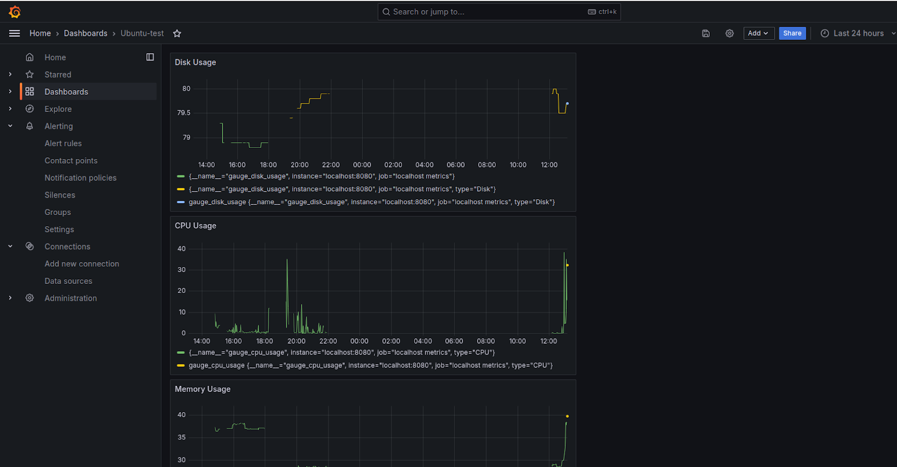

## Detailed Workflow Diagram Explanation

- **Metrics Collection**:
  - Prometheus client in `metrics-monitoring` -> Exposes metrics on `http://localhost:8080/metrics`.

- **Web Application Endpoints**:
  - Web app in `metrics-monitoring` -> Accessible via `http://localhost:5000/` serving `/metrics_usage`, `/avg_usage`, and `/alert`.

- **Prometheus Server**:
  - Prometheus server -> Scrapes `http://localhost:8080/metrics` -> Runs on `http://localhost:9090`.

- **Alertmanager**:
  - Alertmanager -> Runs on `http://localhost:9093`.
  - Prometheus sends alerts to Alertmanager.
  - Alertmanager triggers alerts and send the notification to `http://localhost:5000/alert`

- **Alert Handling**:
  - Alerts sent to `http://localhost:5000/alert`.
  - Alerts are logged in `alert.log`.

- **Grafana Visualization**:
  - Grafana -> Configured to pull data from Prometheus.
  - Dashboards visualize metrics and alerts.

## Querying to Dashboard Example

Note : Query to be done in `UTC` time

Sample Query on Prometheus

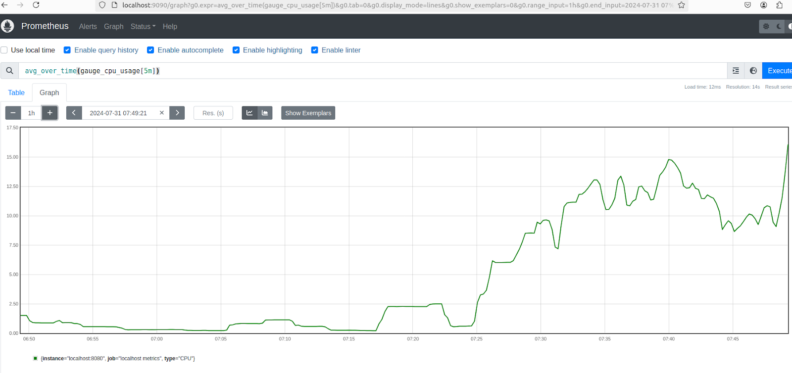

### Usecases

- Providing proper start and end time and querying all `metrics` for that time range

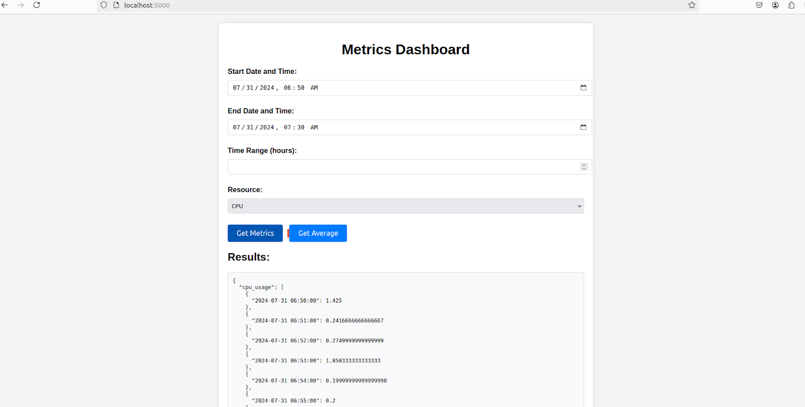

- Providing proper start and end time and range and querying only `average` for that time range

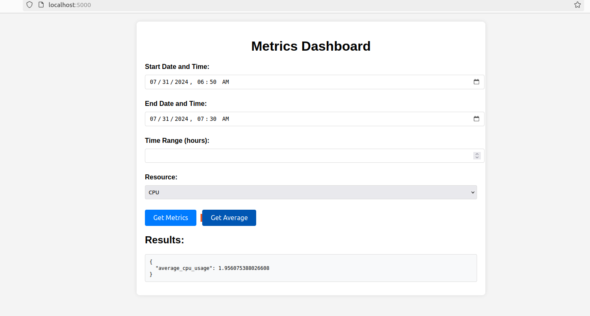

- Providing improper time where there is no data available

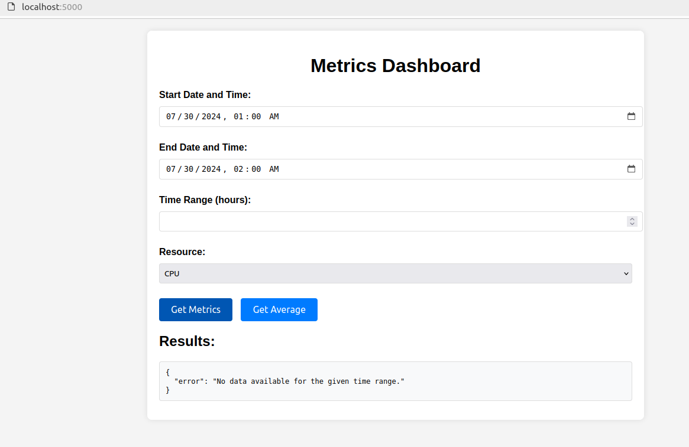

- Provding start time greater than end time


- Provding No time or range

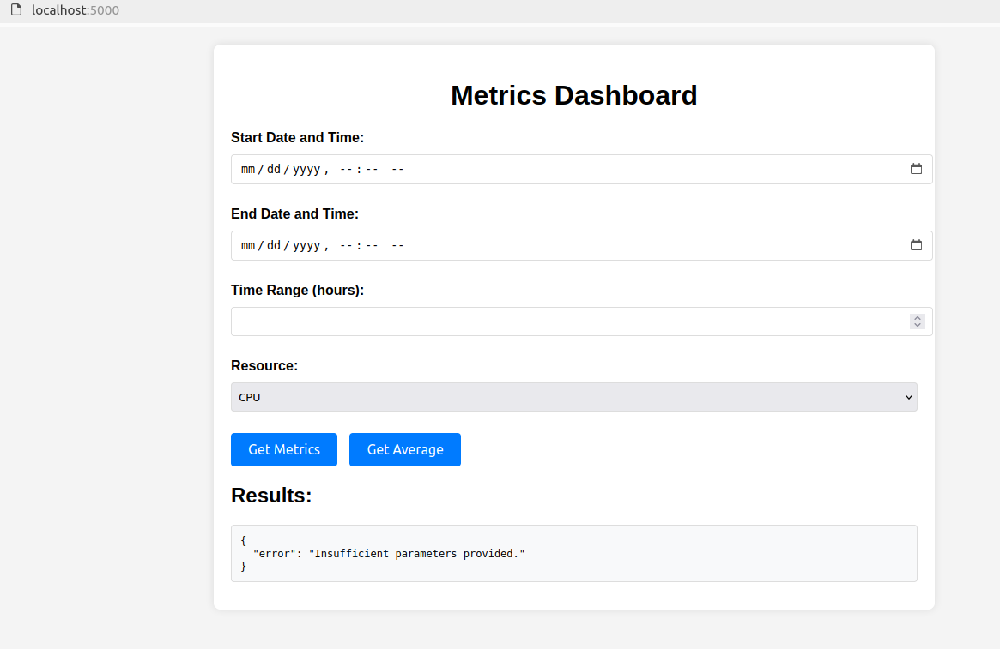

- Provding only range

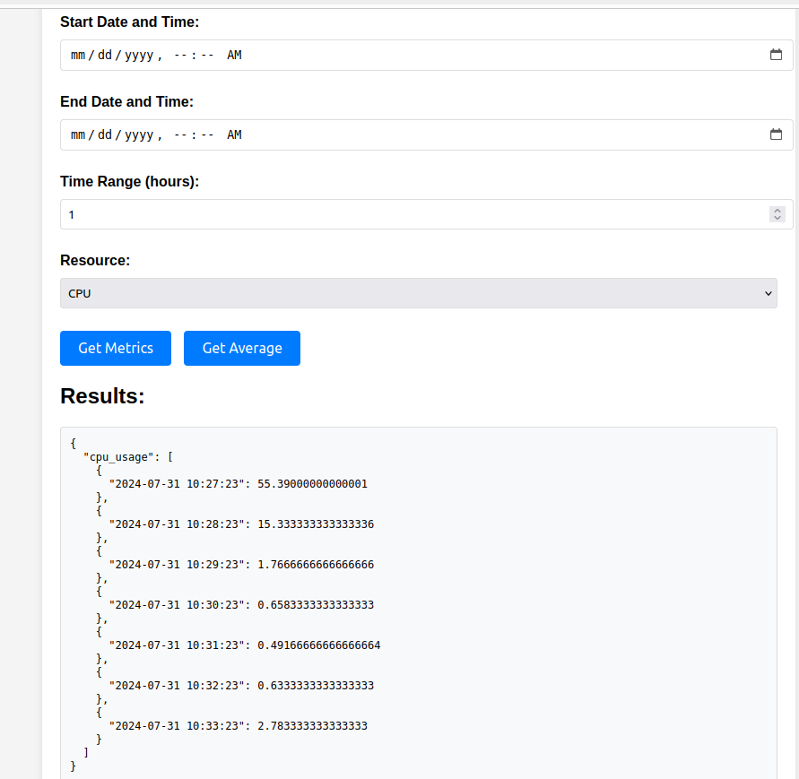